# POCUS-kort

Sex dubbelsidiga fickkort i A6 för fokuserat ultraljud (POCUS) hos vuxna: **Hjärta, Lunga, Buk 1–4** (njurar, urinblåsa, fri vätska och gallblåsa), **Bukaorta** och **DVT**. Framsidan hjälper till att hitta vyn och baksidan att bedöma och mäta.

Korten är minnesstöd efter praktisk introduktion. De är inte fastställda regionala rutiner och ersätter inte klinisk bedömning eller lokala rutiner.

Versionen står i licensraden på sista kortets baksida och som tagg i det här repot.

## Filer

| Fil | Innehåll |
|---|---|
| [pocus-kort-A6.pdf](pocus-kort-A6.pdf) | Alla tolv sidor i A6 (105 × 148 mm), i kortordning. |
| [pocus-kort-A4.pdf](pocus-kort-A4.pdf) | Fyra sidor per A4-ark med skärlinjer, för utskrift på vanlig skrivare. |
| [pocus-kort.pptx](pocus-kort.pptx) | Redigerbart original i PowerPoint. Typsnittet är Source Sans Pro. |
| [tryck/alla-kort-pdfx4.pdf](tryck/alla-kort-pdfx4.pdf) | Tryckfil: PDF/X-4 i CMYK för ISO Coated v2 300 % (ECI), 3 mm utfall, alla tolv sidor. |
| `tryck/<kort>-pdfx4.pdf` | Samma tryckfil per kort, för omtryck av enstaka kort. |
| [forhandsvisning/](forhandsvisning/) | Förhandsbilder av varje sida. |

## Förhandsvisning

| | Framsida | Baksida |
|---|---|---|
| Hjärta | 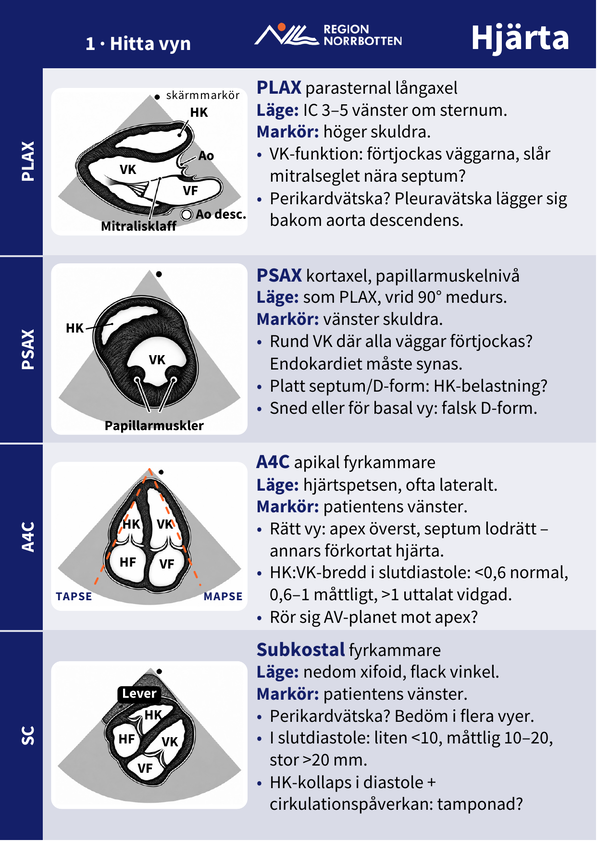 | 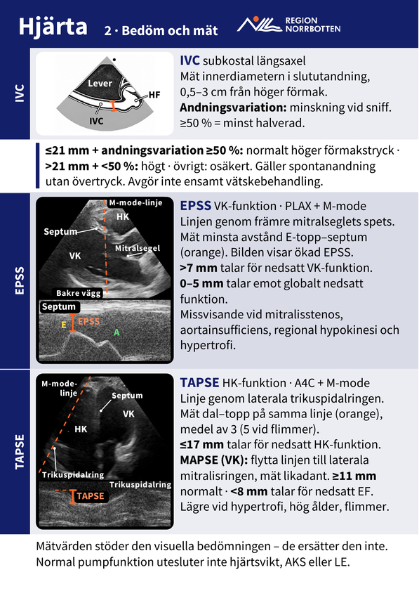 |
| Lunga | 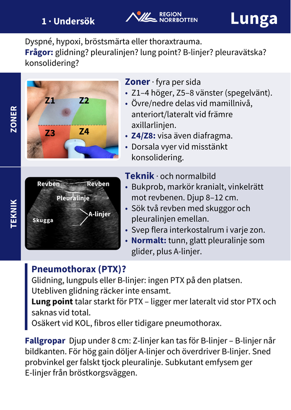 | 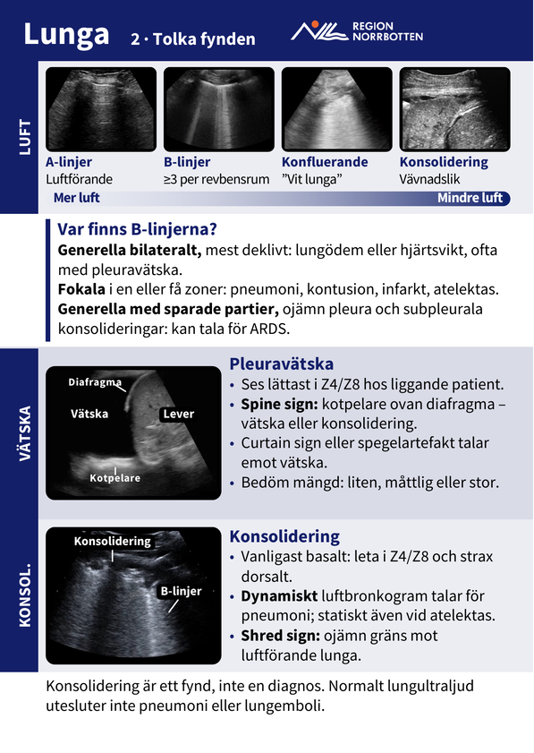 |
| Buk 1–2: njurar och urinblåsa | 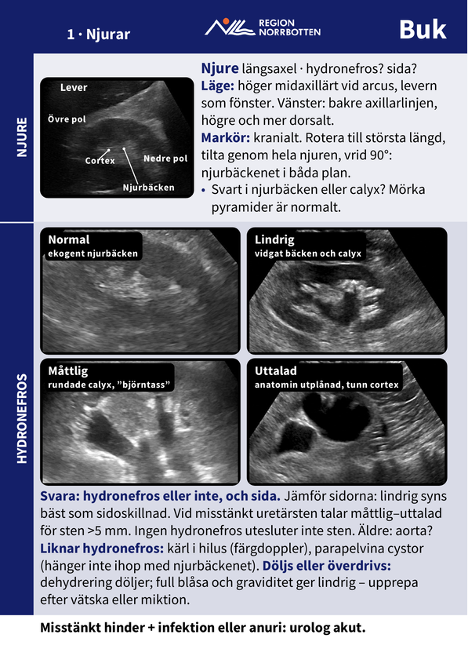 | 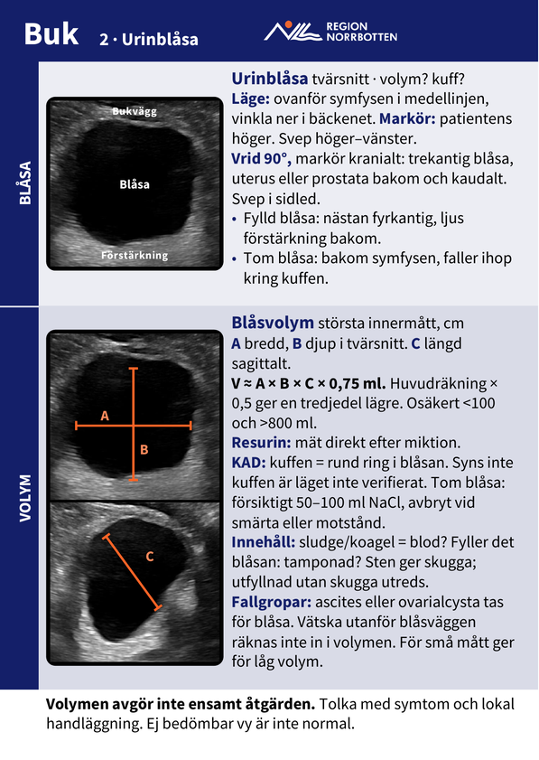 |
| Buk 3–4: fri vätska och gallblåsa | 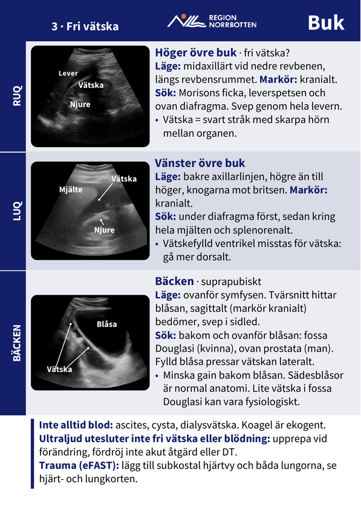 | 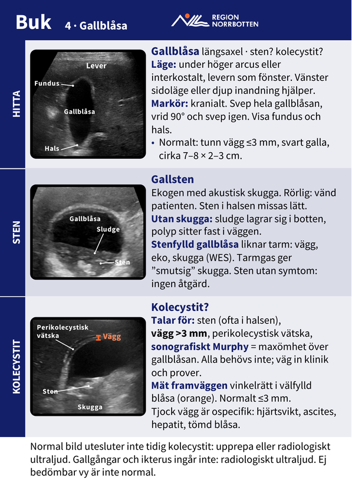 |
| Bukaorta | 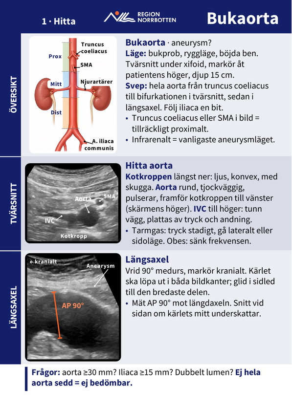 | 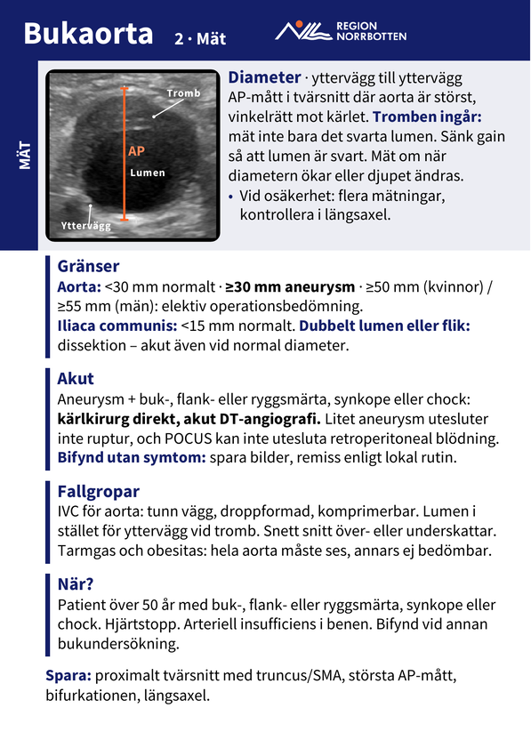 |
| DVT | 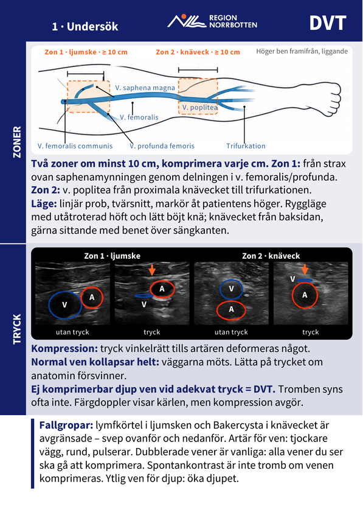 | 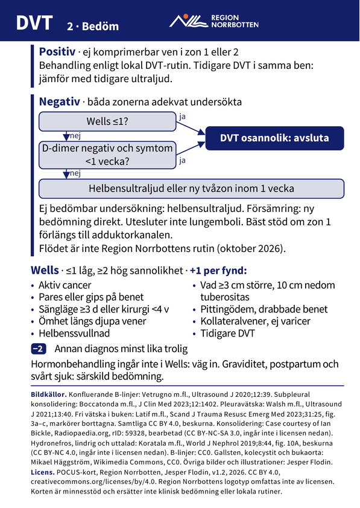 |

## Tryck

- A6 stående, 105 × 148 mm skuret, 4+4, 3 mm utfall, dubbelsidigt och vänt längs långsidan.
- I den samlade tryckfilen är udda sidor framsidor och jämna sidor baksidor. I filerna per kort är sida 1 framsida och sida 2 baksida.
- Korten är gjorda för ring: borrhål Ø 5 mm, centrum 8 mm från skuren överkant och ytterkant, uppe till vänster sett från framsidan. Hålet är inte markerat i trycket.
- Konvertera inte om tryckfilerna: svart text är 100 % K och profilfärgerna har Region Norrbottens CMYK-värden. Trycker tryckeriet med en annan profil behöver filerna göras om.

## Licens

Korten licensieras under [CC BY 4.0](LICENSE): POCUS-kort, Region Norrbotten, Jesper Flodin. Bildkällorna står på sista kortets baksida. Några bilder har andra villkor och omfattas inte av licensen, bland dem två som bara får användas icke-kommersiellt. Det gäller också Region Norrbottens logotyp. Se [LICENS-OMFATTNING.md](LICENS-OMFATTNING.md).
